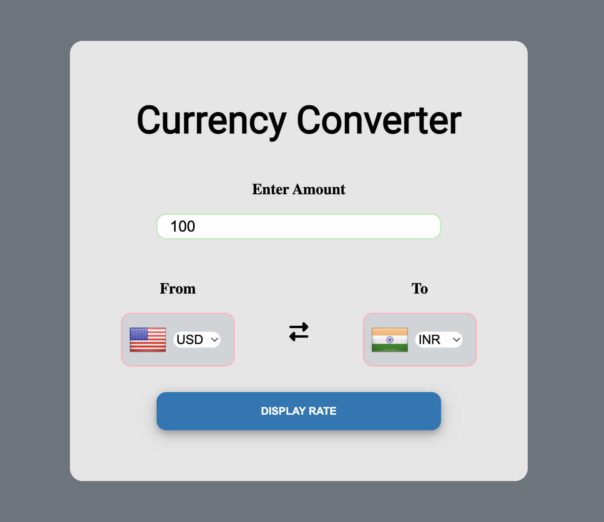

# Currency Converter

[Use Currency Converter](https://currency-converter-kt.netlify.app/)

Convert currencies effortlessly with this intuitive Currency Converter tool. Input the amount, select the 'from' and 'to' currencies, and get accurate currency conversion rates instantly.

## Overview

This Currency Converter allows users to convert currencies by specifying the amount and selecting currencies from an extensive list of country codes. Utilizing data from `variousCountryListFormats.js` by @incredimike, the converter provides a comprehensive selection of countries with ISO 3166 codes.

## Features

- **Amount Input:** Enter the amount you wish to convert.
- **Currency Selection:** Choose 'from' and 'to' currencies from a wide array of country codes.
- **Country Flags:** Integrated country flags using `https://flagsapi.com/` for visual identification of currency codes.
- **Real-Time Rates:** Fetches live currency rates from the `currency-api` by @fawazahmed0 for accurate conversions.

## How to Use

1. Enter the amount you want to convert.
2. Select the 'from' currency code.
3. Choose the 'to' currency code.
4. Instantly view the converted amount.

## Technologies Used

- JavaScript
- variousCountryListFormats.js by @incredimike
- FlagsAPI for country flags
- currency-api by @fawazahmed0 for live currency rates

## Preview

## Getting Started

To use the Currency Converter:

1. Clone this repository.
2. Open the `index.html` file in your web browser.

## Credits

- **variousCountryListFormats.js:** @incredimike
- **FlagsAPI:** `https://flagsapi.com/`
- **currency-api:** @fawazahmed0

## Contributing

Contributions are welcome! Feel free to open issues or pull requests.

## License

This project is licensed under the [MIT License](LICENSE).
